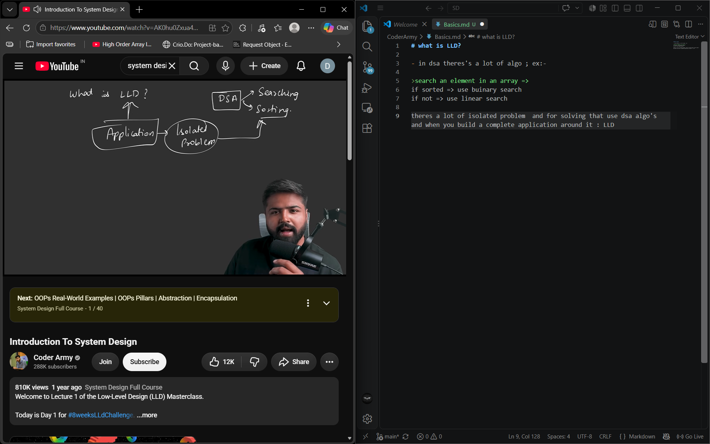
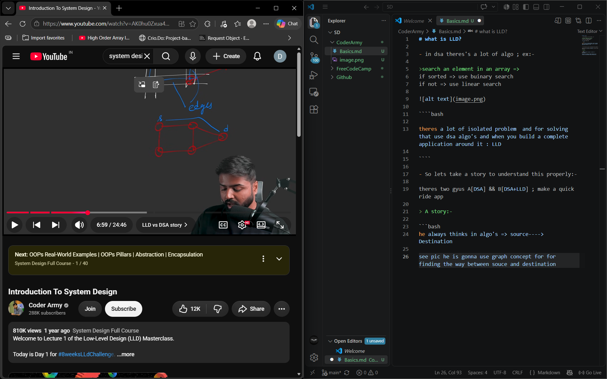
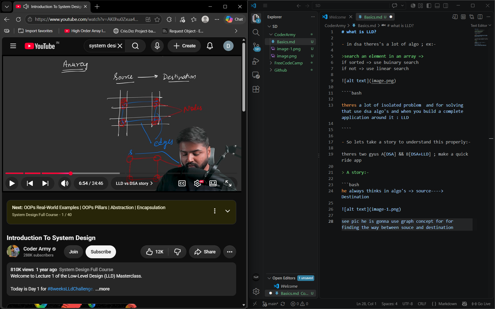
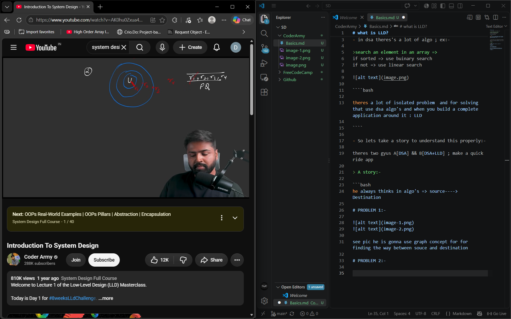
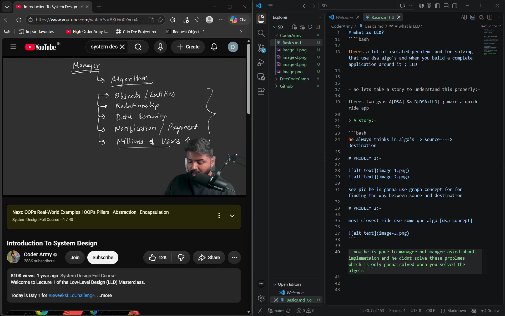
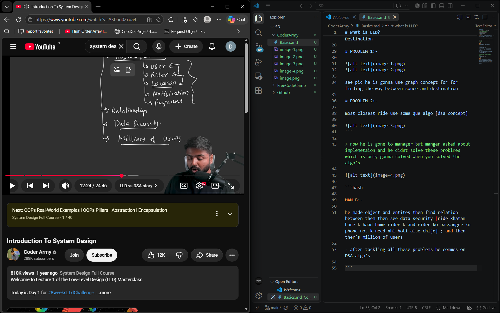
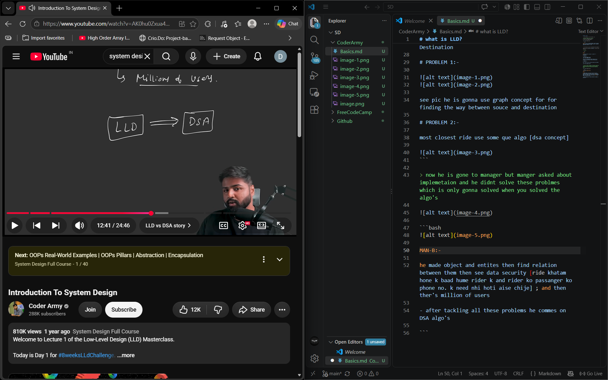
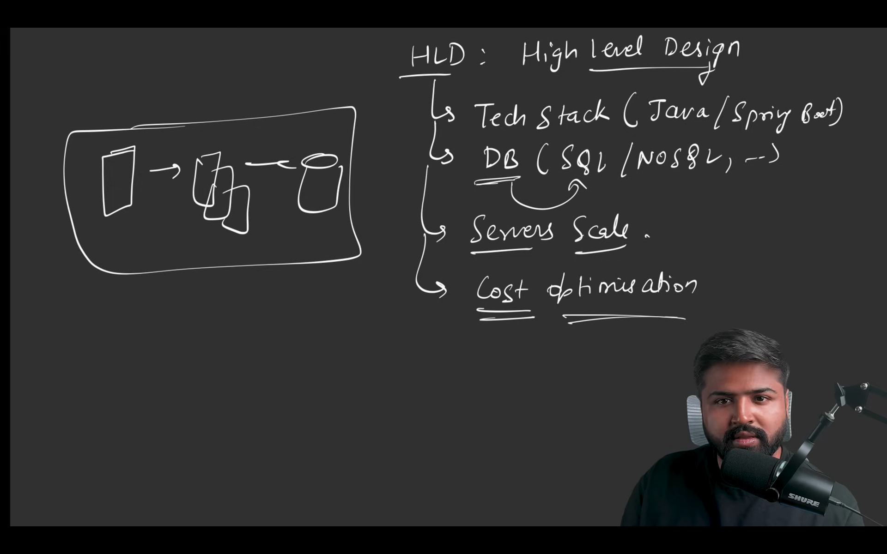
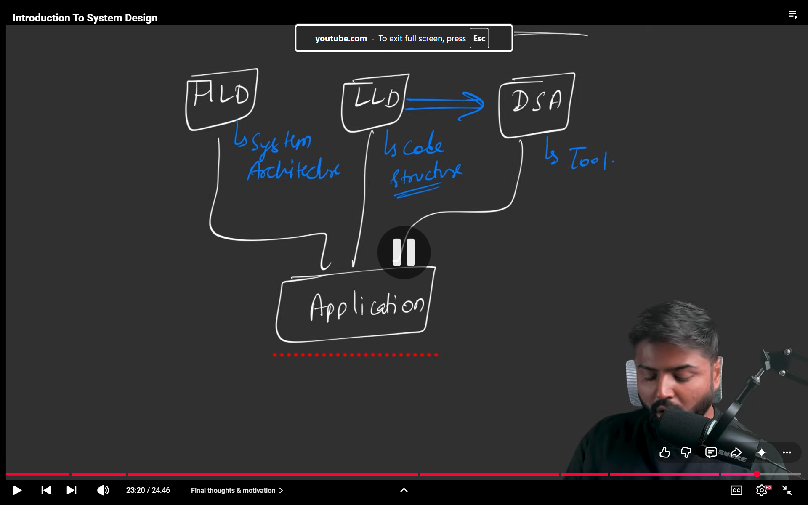

# what is LLD?

- in dsa theres's a lot of algo ; ex:-

>search an element in an array =>
if sorted => use buinary search
if not => use linear search



````bash

theres a lot of isolated problem  and for solving that use dsa algo's and when you build a complete application around it : LLD

````

- So lets take a story to understand this properly:-

theres two gyus A[DSA] && B[DSA+LLD] ; make a quick ride app

> A story:-

```bash

MAN-A:-

he always thinks in algo's => source----> Destination

# PROBLEM 1:-




see pic he is gonna use graph concept for for finding the way between souce and destination 

# PROBLEM 2:-

most closest ride use some que algo [dsa concept]


```

> now he is gone to manager but manger asked about implemetaion and he didnt solve these problmes which is only gonna solved when you solved the algo's 



```bash




MAN-B:-

he made object and entites then find relation between them then see data security [ride khatam hone k baad hume rider k and rider ko passanger ko phone no. k need nhi hoti aise chije] ; and then ther's million of users 

- after tackling all these problems he commes on DSA algo's 

```

# during desigining LLD ther's 3 things you focused on most => 3 pillars of LLD

1. Scalibilty => jab million of users aayenge tab voh usko kaise handle karega

2. Maintainbility => koi naya feature dala 4 purane feature phat gya ; easily debuged

3. Re-usablilty => highly resuable ; notification payument are common in any apps => plug and play : aapka code Tigitly coupled na ho 

***Plug and play = component ko easily replace/add/remove kar pao without breaking the whole system.***

Rider-mapping algo is damn too common :- mapping algo is used everyweher :- highly resaubale 

## WHAT is not LLD?

HLD:- 

### FINALLY SUMMARY

tino milake hi application banate hai 



***IF DSA IS BRAIN OF AN APPLICATION AND LLD IS THE SKELTON** 