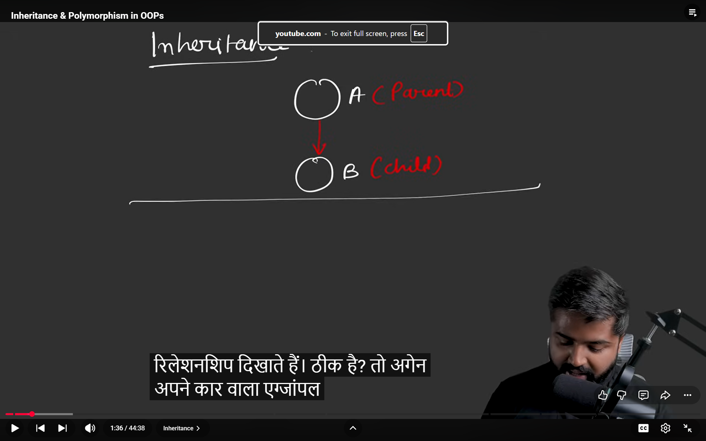
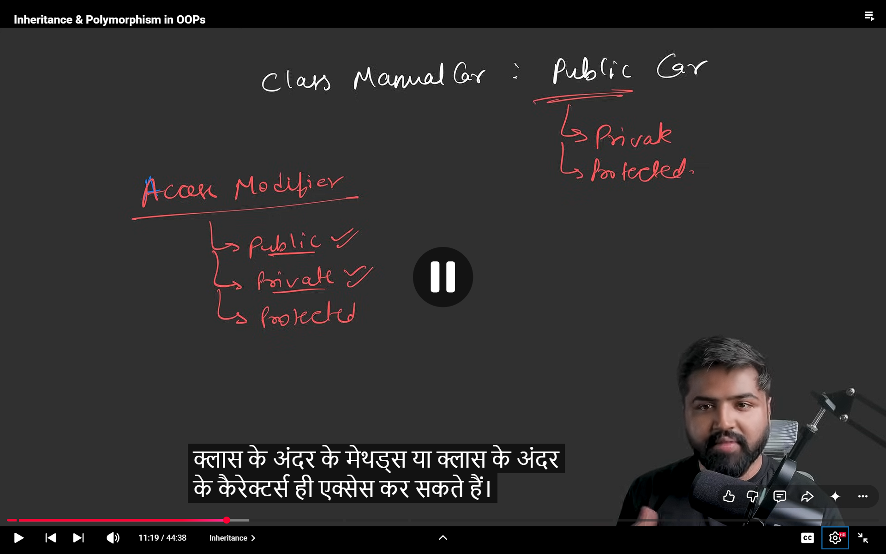
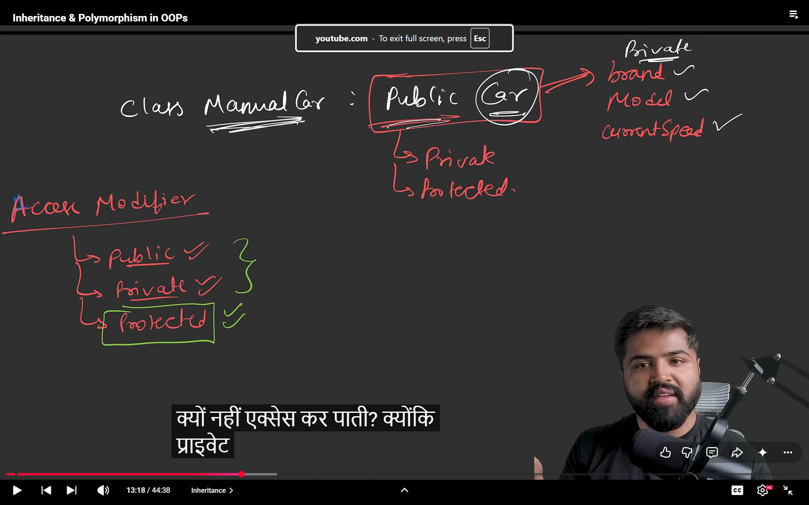
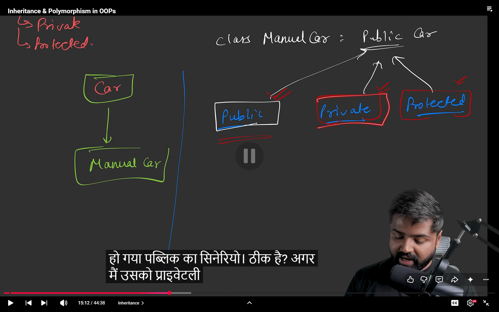

# actually objects related hotes hai a and b are related 



## Car example 


> car is gonna have characters and behaviour joki hur ek car me honge 

- now manual car me allag behavioure honge and electric car me alag car me honge 


## REPESENTING IN OOPS

> syntax to make something inherit

class Manual Car : Public Car{
    // yha pe voh define karna joh maunal car me ho but ye voh sarre car k methods call kar sakti hai 
}


## ACCESS MODIFIERS



- public hur koi access  : joh humari parent class hai boh public rahegi 

- private class k andar k variables hi call

- protected usko class k bahar koi access nhi kar sakta but child class k methods acesss kar sakte hai 

> if methods privatly declared and publically inherit then it won't be able to inherit the car 



> if public koi bhi acess 


> if protected then only manual car k characters can do that 


## PUBLIC :-



if public written then cars public method will be public in manual if protected then it will be protected in manual if private tab voh thodi na acess kar sakte hai 

## PRIVATE:-


Car k saare method manual me private ho jaate ; manlo koi manual car ko inherit kar rha hota toh voh manual car k characters acess nhi akr pata 

## PROTECTED:-

same public -> public ; protected -> protected ; private acess X


````bash

most of the LLD me public bcz inherit ka phir concept hi kya rha 