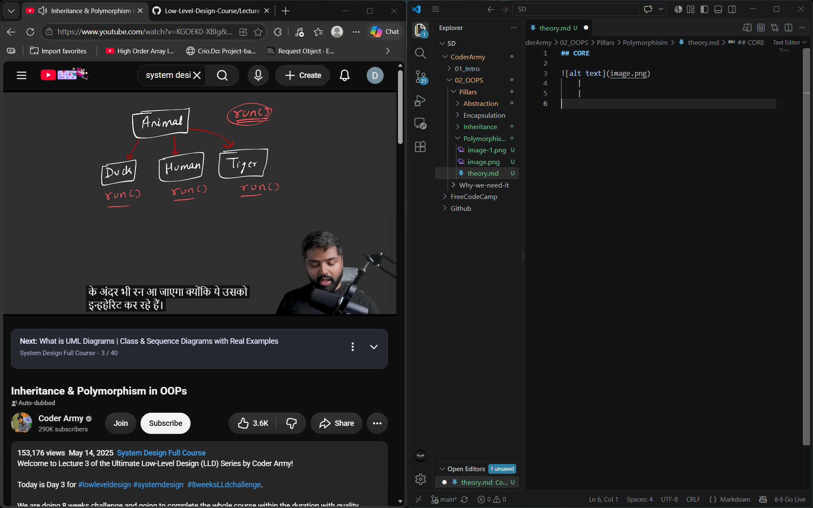
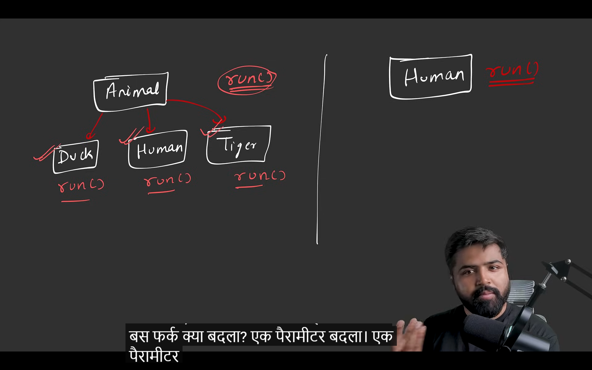
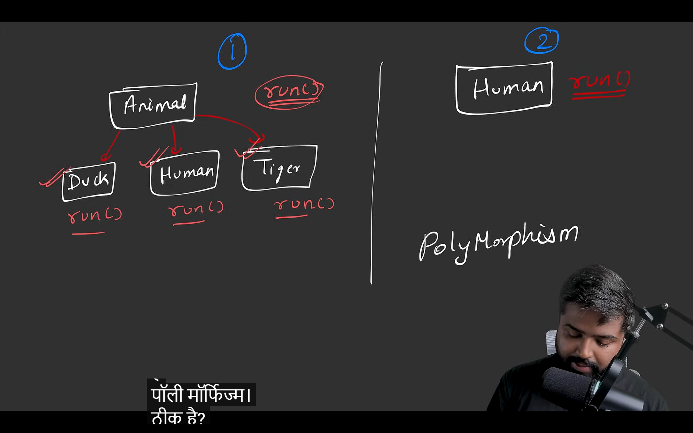
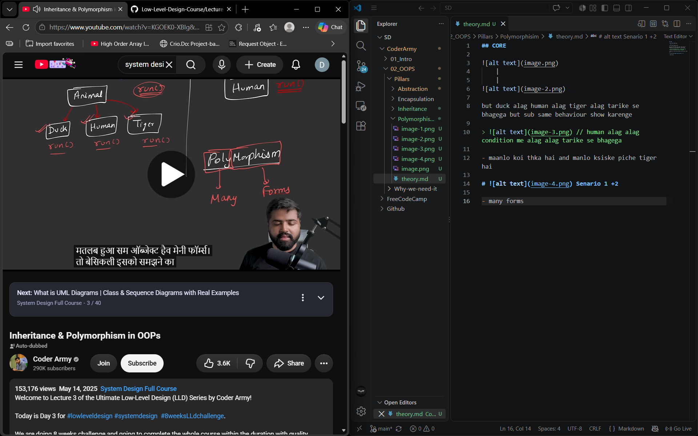
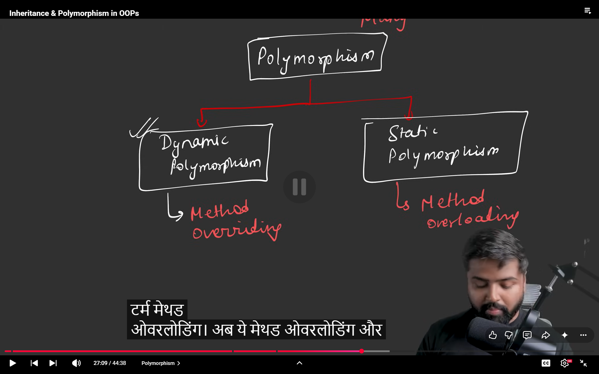
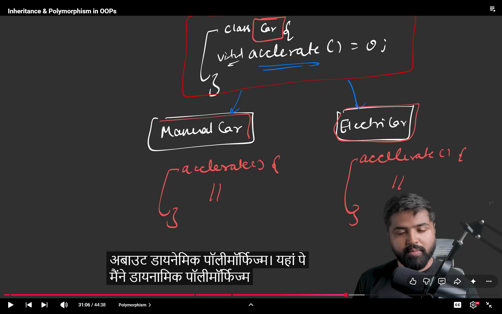
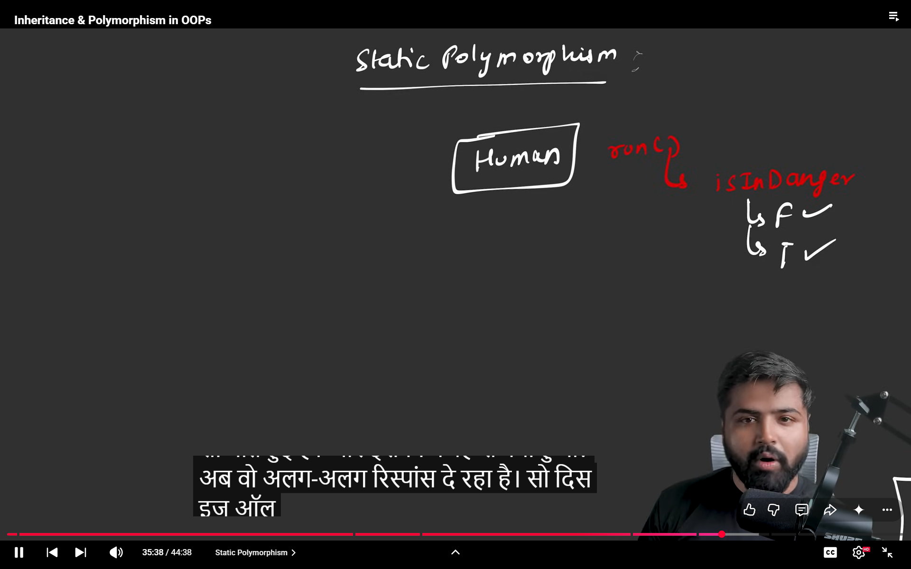
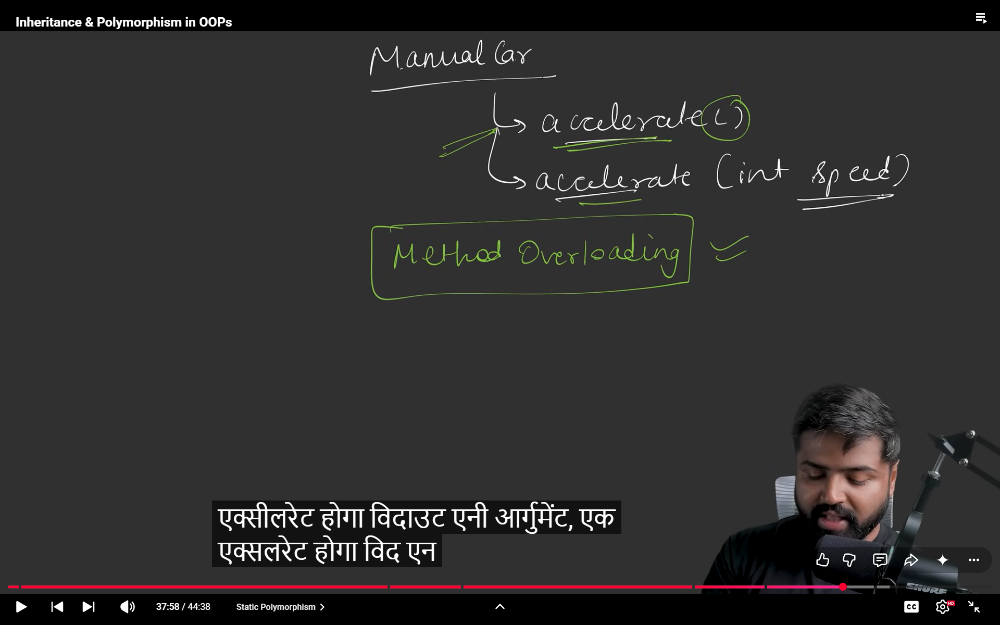

## CORE 

    |
    |

but duck alag human alag tiger alag tarike se bhagega but sub same behaviour show karenge 

>  // human alag alag condition me alag alag tarike se bhagega 

- maanlo koi thka hai and manlo ksiske piche tiger hai 

#  Senario 1 +2

- many forms 

## TYPES OF POLYMORPHISM => 

DYNAME -> SCENARIO 1
STATIC -> SCENARIO 2

 // so this is the more broad side 

# NOW IN POLY

hur ek gaadi alag alag tarike se accelerate karti hogi ?

> to reolve this use virtual fn and make an abstract class

## STATIC POLY =>

>  human ex

>  Car ex