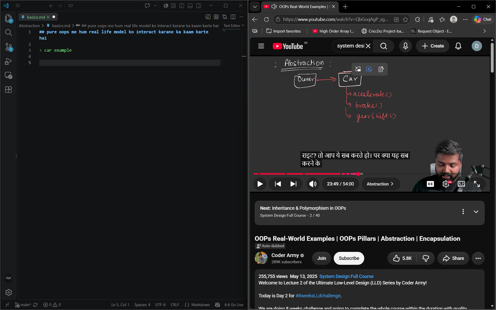
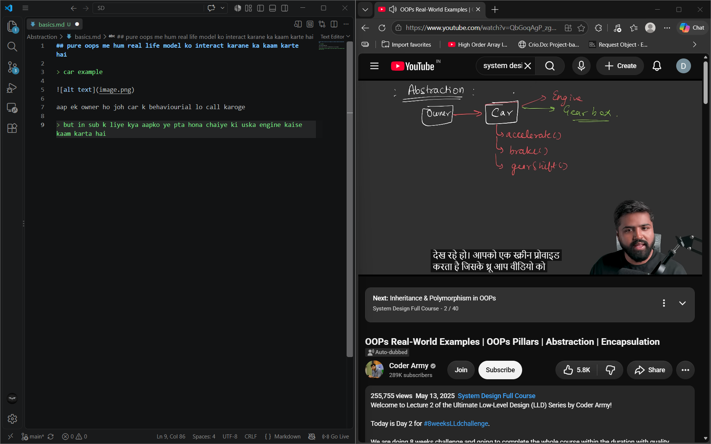
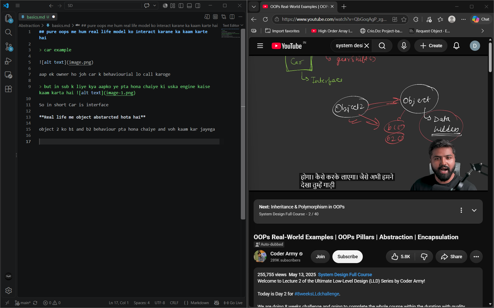

## pure oops me hum real life model ko interact karane ka kaam karte hai 

> car example 

aap ek owner ho joh car k behaviourial lo call karoge 

> but in sub k liye kya aapko ye pta hona chaiye ki uska engine kaise kaam karta hai 

So in short Car is interface

**Real life me object abstarcted hota hai**

object 2 ko b1 and b2 behaviour pta hona chaiye and voh kaam kar jayega 

tum gaadi me bethe and tumhe  ye pta hai gaddi chane k liye chabi lagao accelerator dabbo tum andar ka engine jaanne ki nhi jarrurat hsai 

**Abstraction hides  unnessary details from a client and showcase only what is neccsary**