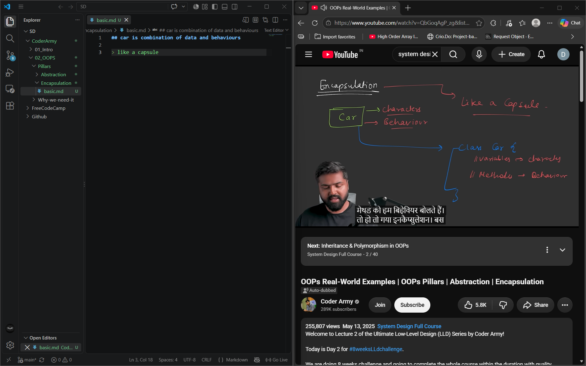
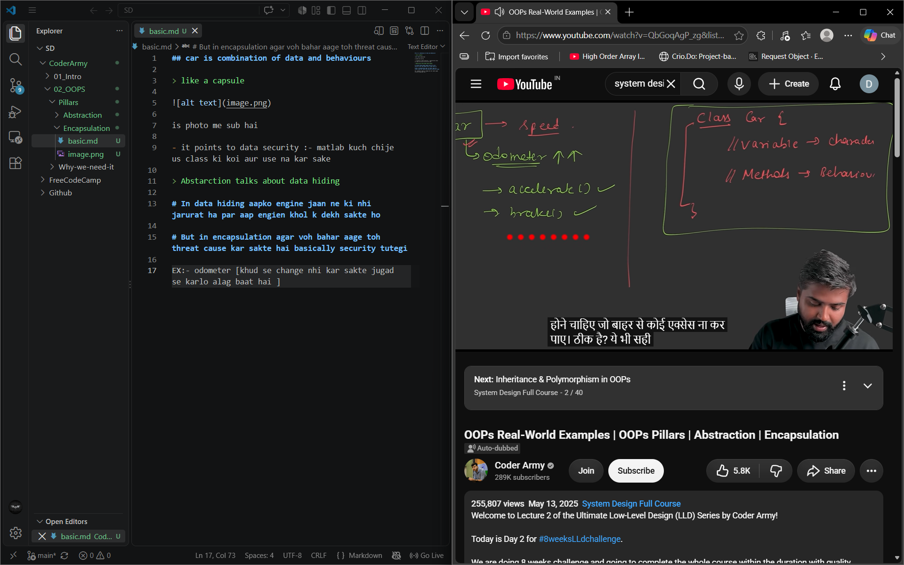

## car is combination of data and behaviours

> like a capsule 

is photo me sub hai 

- it points to data security :- matlab kuch chije us class ki koi aur use na kar sake 

> Abstarction talks about data hiding 

# In data hiding aapko engine jaan ne ki nhi jarurat ha par aap engien khol k dekh sakte ho 

# But in encapsulation agar voh bahar aage toh threat cause kar sakte hai basically security tutegi

EX:- odometer [khud se change nhi kar sakte jugad se karlo alag baat hai ]

# now ab jab voh acsees na kar paye 
- public [koi bhi access kar sakta hai]
- private
- protected [baad me]

