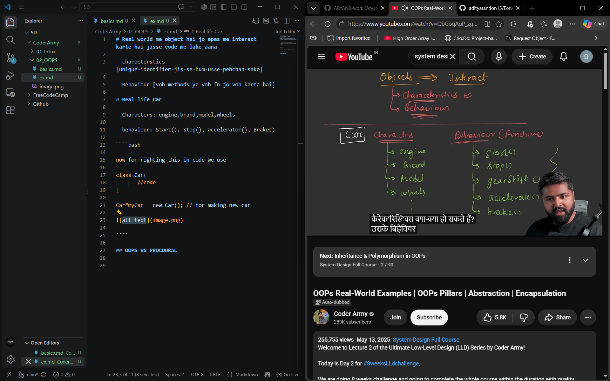
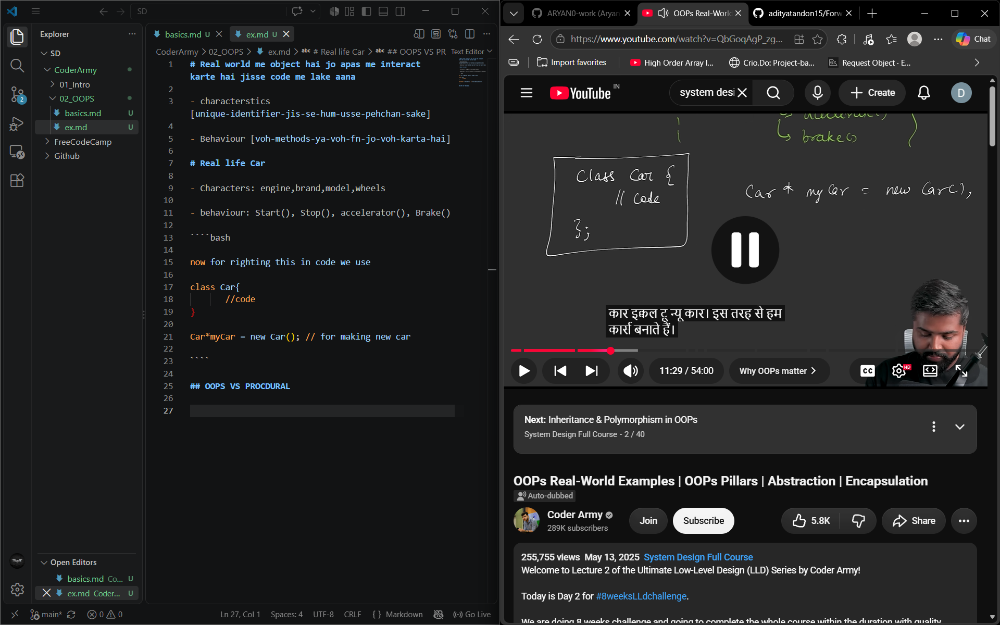
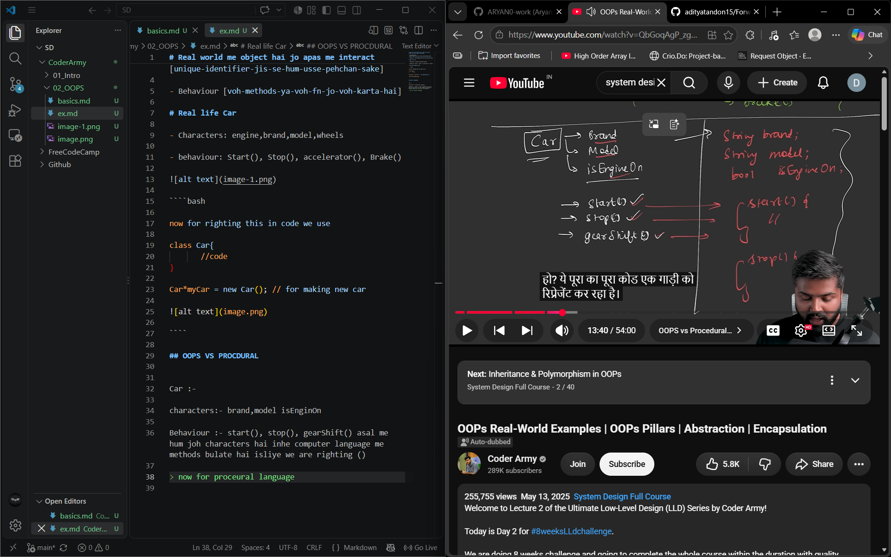
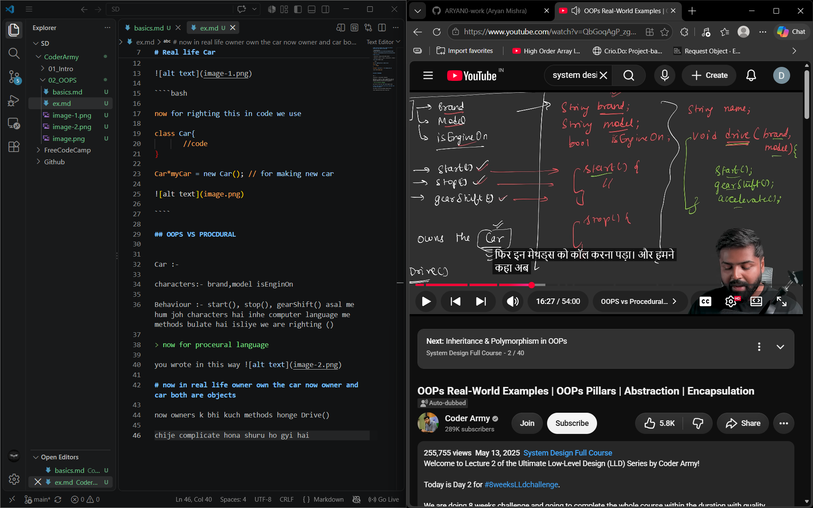
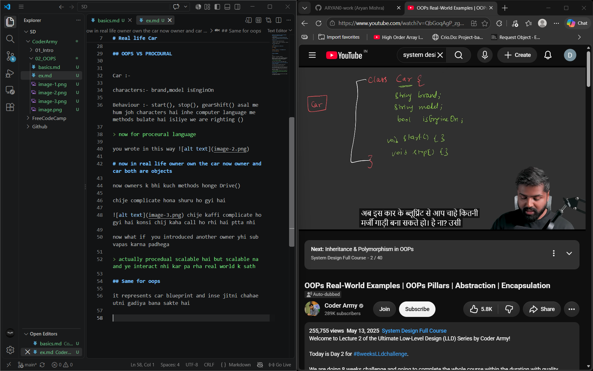
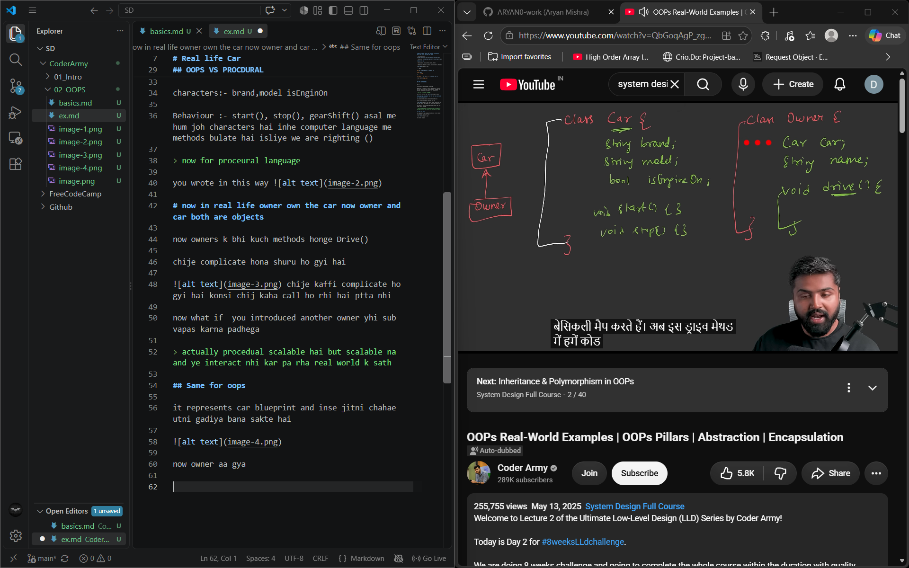
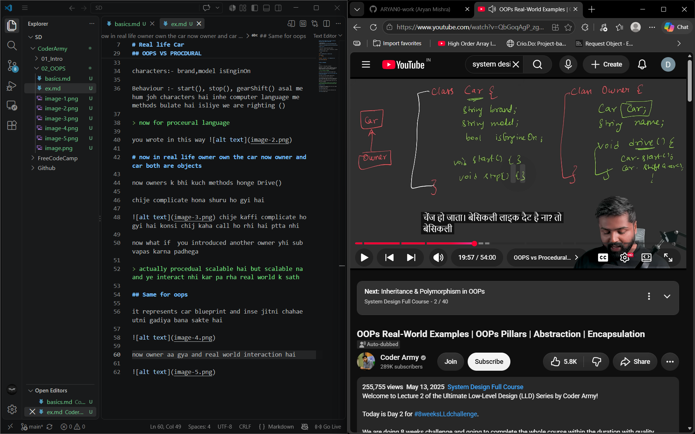

# Real world me object hai jo apas me interact karte hai jisse code me lake aana 

- characterstics [unique-identifier-jis-se-hum-usse-pehchan-sake]

- Behaviour [voh-methods-ya-voh-fn-jo-voh-karta-hai]

# Real life Car

- Characters: engine,brand,model,wheels

- behaviour: Start(), Stop(), accelerator(), Brake()



````bash

now for righting this in code we use 

class Car{
       //code
}

Car*myCar = new Car(); // for making new car



````

## OOPS VS PROCDURAL


Car :-

characters:- brand,model isEnginOn

Behaviour :- start(), stop(), gearShift() asal me hum joh characters hai inhe computer language me methods bulate hai isliye we are righting ()

> now for proceural language

you wrote in this way 

# now in real life owner own the car now owner and car both are objects 

now owners k bhi kuch methods honge Drive()

chije complicate hona shuru ho gyi hai 

 chije kaffi complicate ho gyi hai konsi chij kaha call ho rhi hai ptta nhi

now what if  you introduced another owner yhi sub vapas karna padhega

> actually procedual scalable hai but scalable na and ye interact nhi kar pa rha real world k sath

## Same for oops 

it represents car blueprint and inse jitni chahae utni gadiya bana sakte hai



now owner aa gya and real world interaction hai 



now yhi drive method dekho kitna easy ho gya

