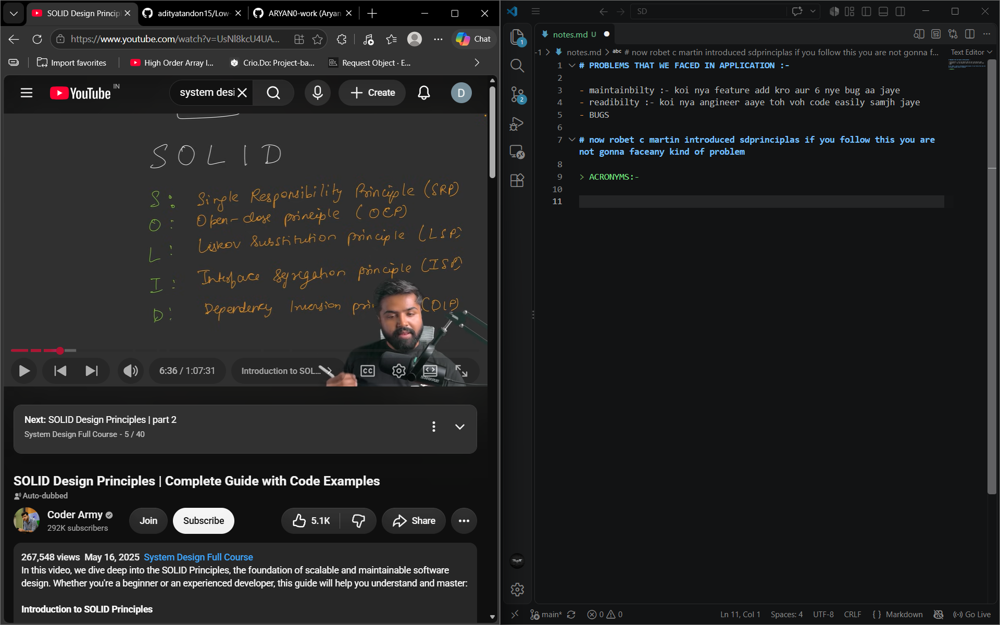
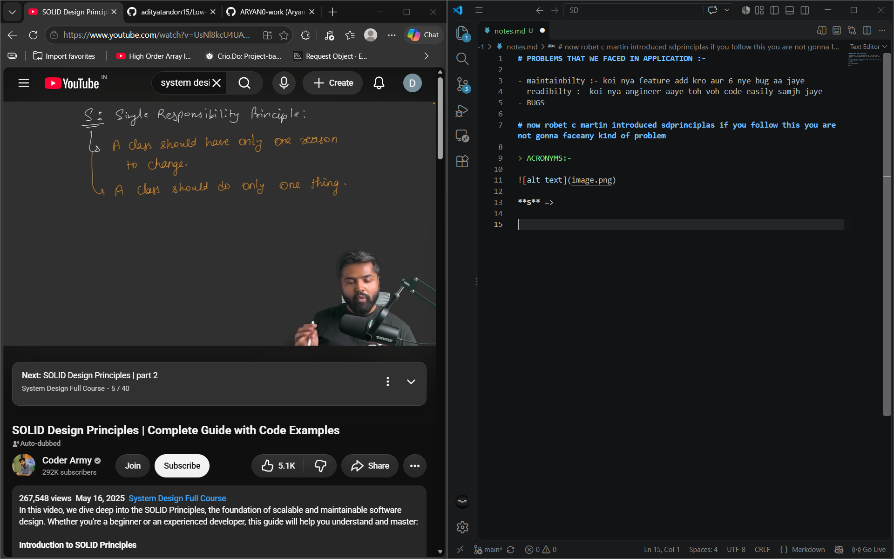
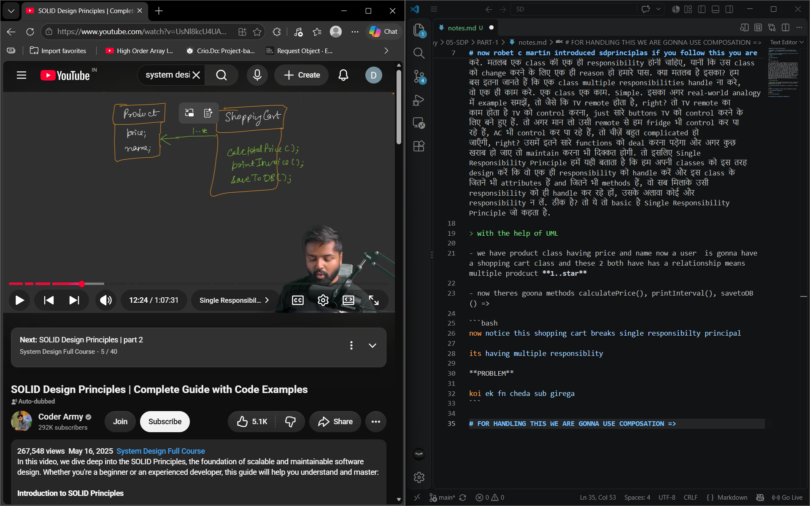

# PROBLEMS THAT WE FACED IN APPLICATION :-

- maintainbilty :- koi nya feature add kro aur 6 nye bug aa jaye 
- readibilty :- koi nya angineer aaye toh voh code easily samjh jaye 
- BUGS 

# now robet c martin introduced sdprinciplas if you follow this you are not gonna faceany kind of problem

> ACRONYMS:-



**S** =>



- तो ये है इसकी definition: Single Responsibility Principle कहता है, a class should have only one reason to change, या फिर it should do only one thing. क्या मतलब है इसका? देखो, simple से अगर शब्दों में समझें, तो एक class है, ठीक है, वो इस तरह लिखी होनी चाहिए कि वो सिर्फ एक ही काम करे. मतलब एक class की एक ही responsibility होनी चाहिए, यानी कि उस class को change करने के लिए एक ही reason हो हमारे पास. क्या मतलब है इसका? हम बस इतना जानते हैं कि एक class multiple responsibilities handle ना करे, वो एक ही काम करे. एक class एक काम. Simple. इसका अगर real-world analogy में example समझें, तो जैसे कि TV remote होता है, right? तो TV remote का काम होता है TV को control करना, just सारे buttons TV को control करने के लिए बने हुए हैं. तो अगर मान लो उसी remote से हम fridge भी control कर पा रहे हैं, AC भी control कर पा रहे हैं, तो चीज़ें बहुत complicated हो जाएँगी, right? उसमें इतने सारे functions को deal करना पड़ेगा और अगर कुछ खराब हो जाए तो maintain करना भी दिक्कत होगी. तो इसलिए Single Responsibility Principle हमें यही बताता है कि हम अपनी classes को इस तरह design करें कि वो एक ही responsibility को handle करें और इस class के जितने भी attributes हैं and जितने भी methods हैं, वो सब मिलाके उसी responsibility को ही handle कर रहे हों, उसके अलावा कोई और responsibility न लें. ठीक है? तो ये तो basic है Single Responsibility Principle जो कहता है.

> with the help of UML

- we have product class having price and name now a user  is gonna have a shopping cart class and these 2 both have has a relationship means multiple prodcuct **1..star**

- now theres goona methods calculatePrice(), printInterval(), savetoDB() =>



```bash
now notice this shopping cart breaks single responsibilty principal

its having multiple responsiblity

**PROBLEM**

koi ek fn cheda sub girega 
```

# FOR HANDLING THIS WE ARE GONNA USE COMPOSATION => 