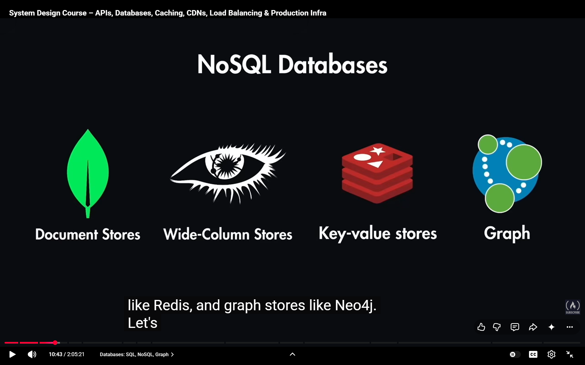
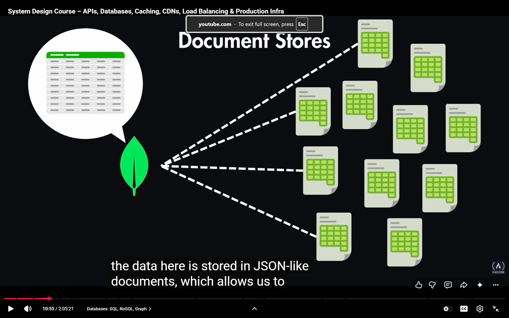
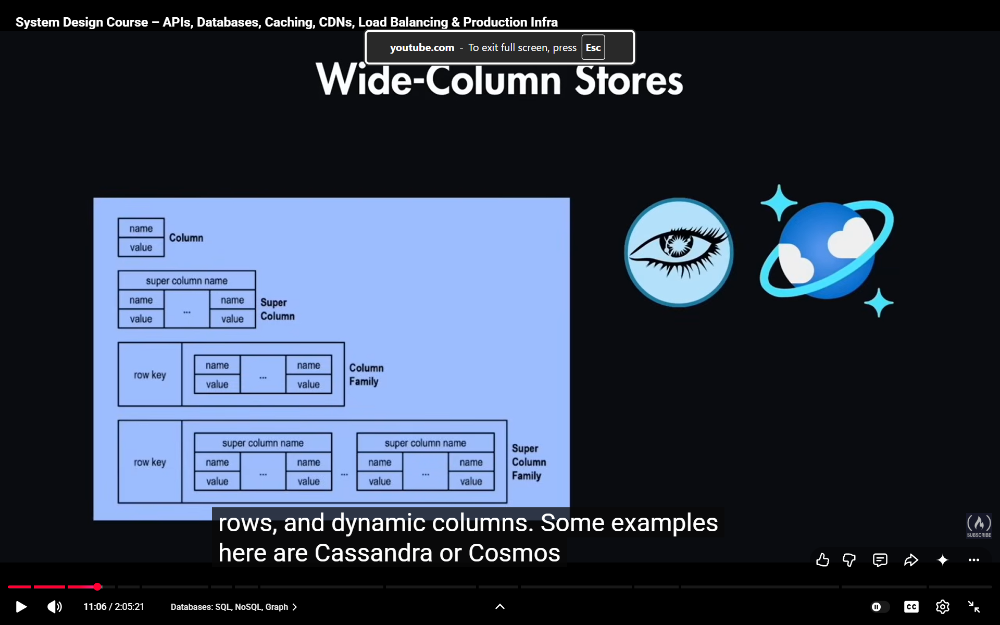
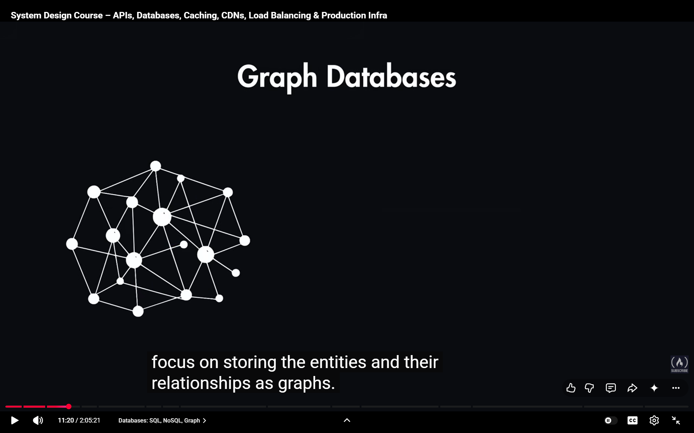
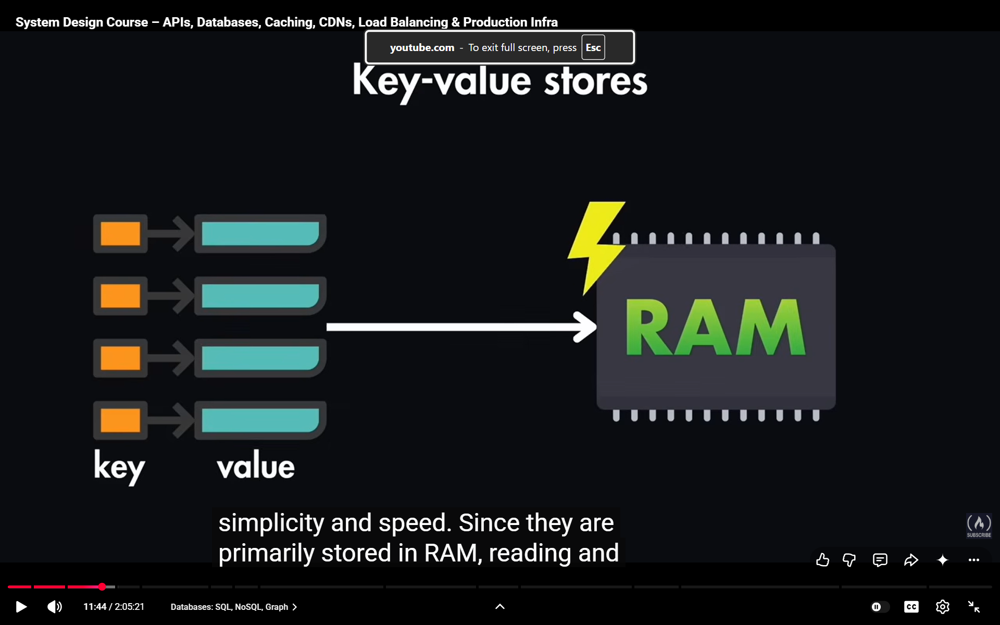

# TYPES

> MONGO

> Cassandra or Cosmos

- can easily handle massive scales

> graph: Neo4j : In amazon they use Neptune db

- focus on storing entities

>other popular examples : manchached , redis

- key value pairs they primaly stored in RAMS , easily fast  to write 