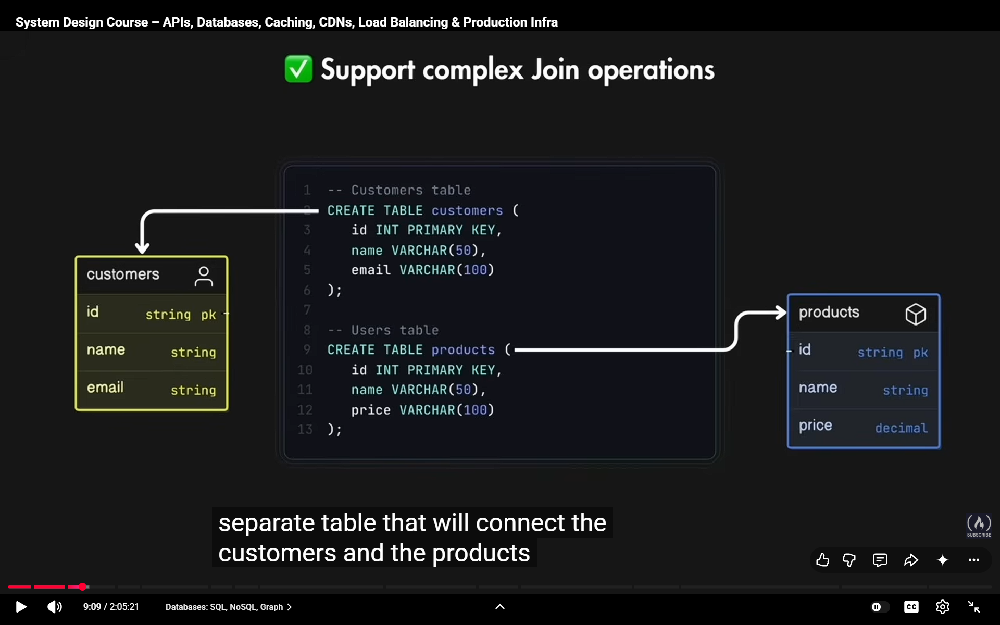
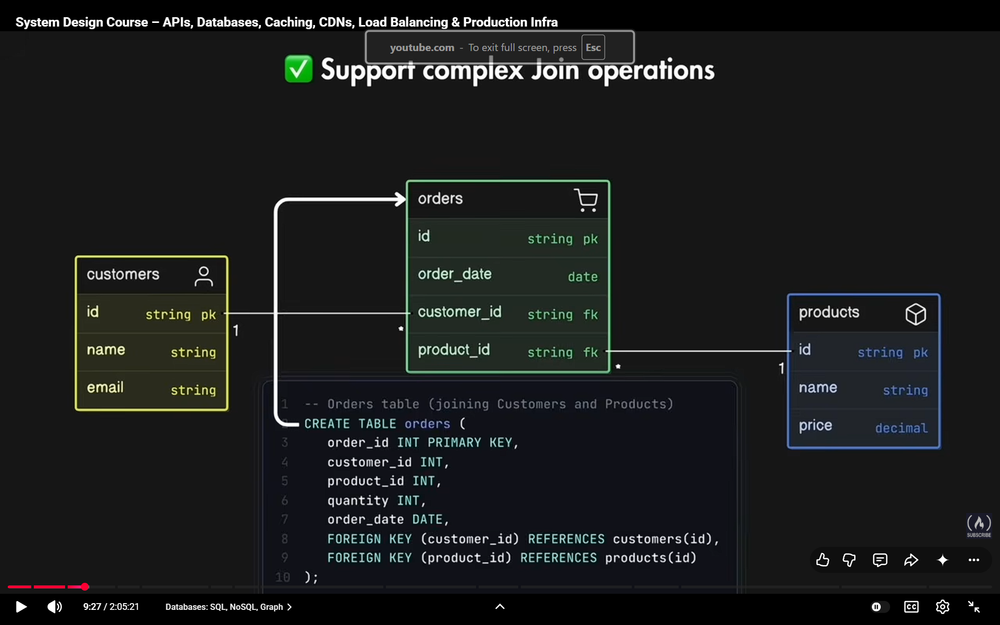
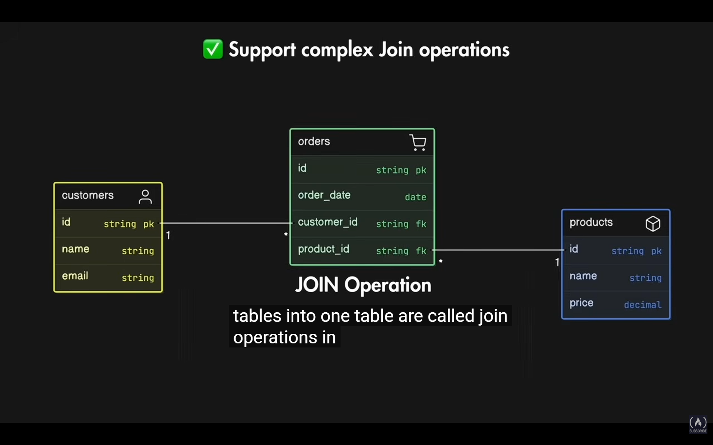
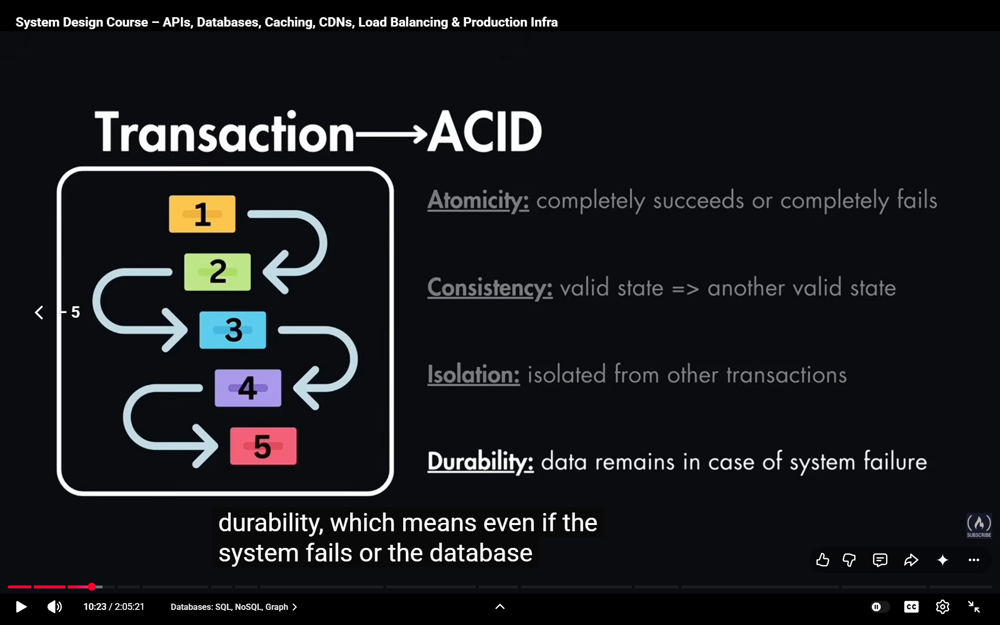

>here data is structred and in forms of rows and columns , similar to spreadsheets

# ADVANTAGES

>see pic 1 =>

>also can do join operations 

>also it provides data integrity and data consistency , especialy for transactions

- transaction is squence of 1 or more then 1 operations, each transaction follow acid acronym , ex:- Bank Transfeer

> EXTRA INFO

- Atomicity:- enitire transaction treated as a single unit .

- Consistency:- theres's gonna be consistency