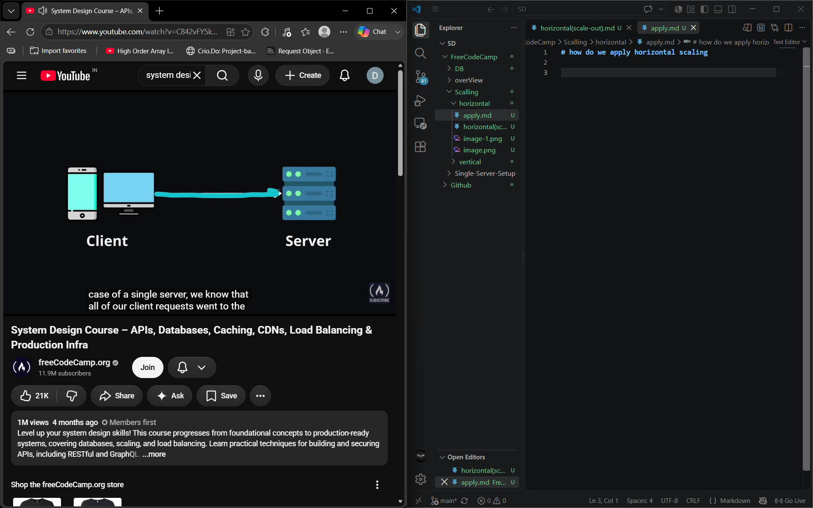
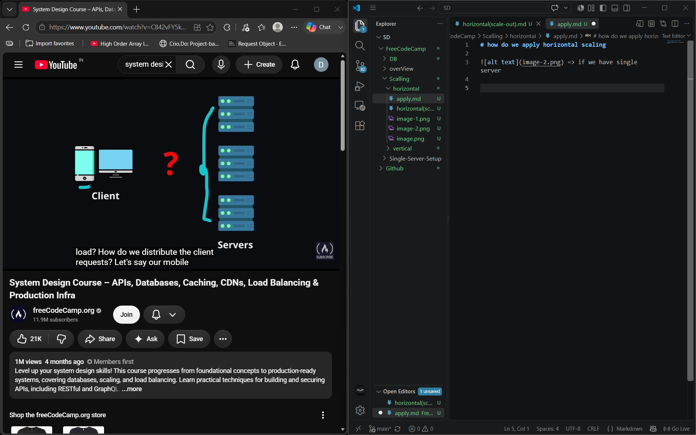
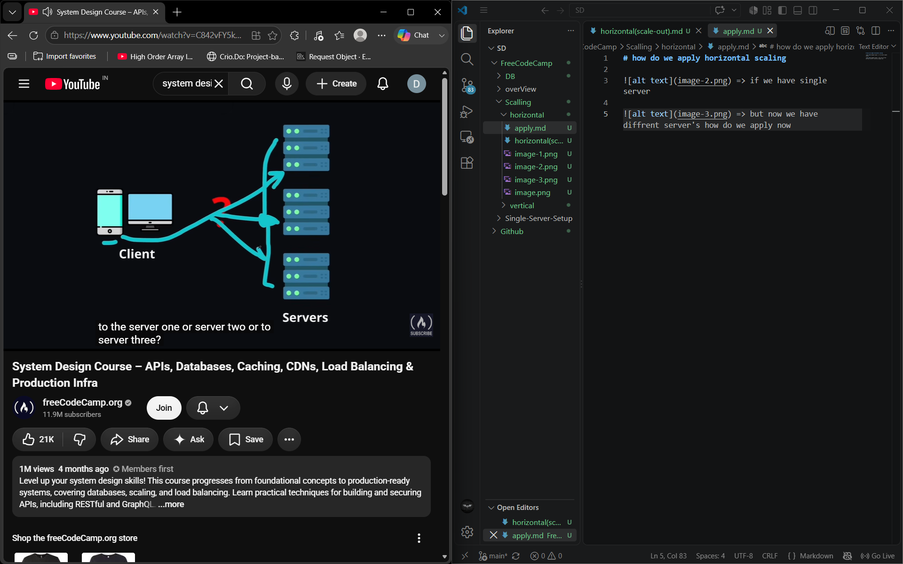
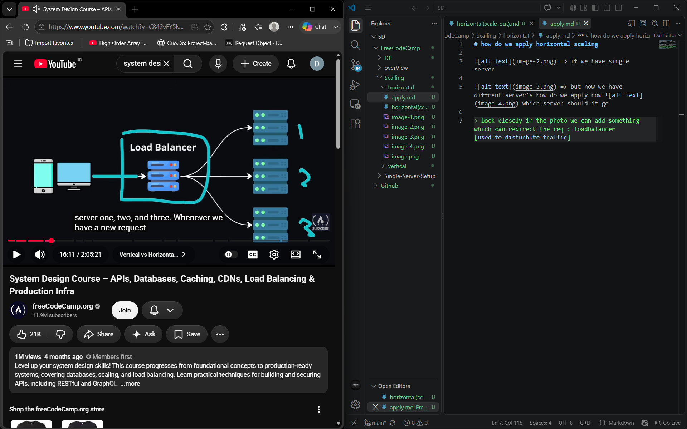
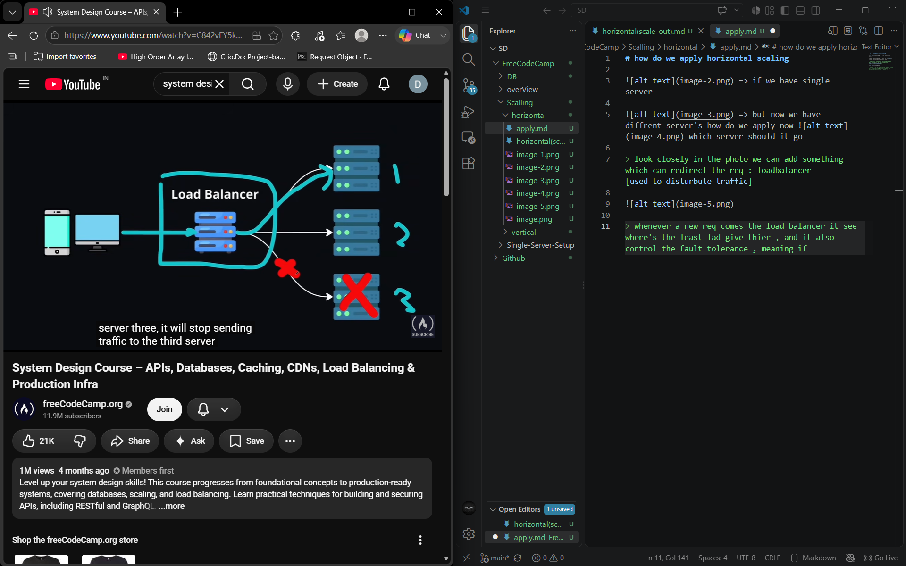
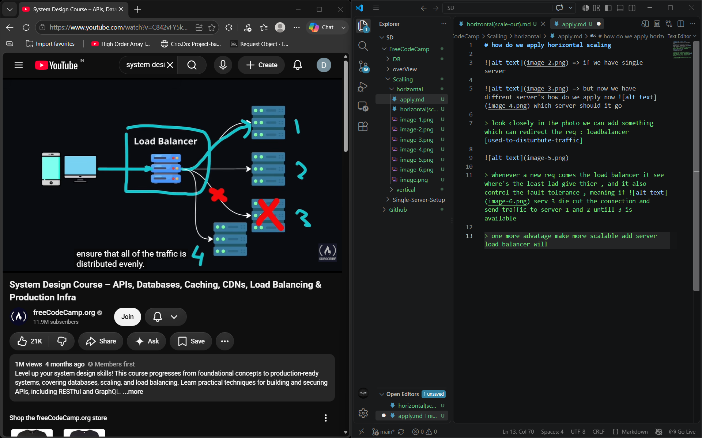
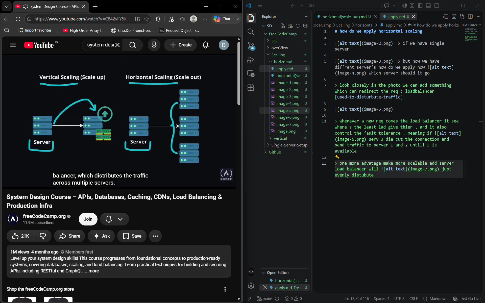

# how do we apply horizontal scaling

 => if we have single server 

 => but now we have diffrent server's how do we apply now  which server should it go 

> look closely in the photo we can add something which can redirect the req : loadbalancer[used-to-disturbute-traffic] 

> whenever a new req comes the load balancer it see where's the least lad give thier , and it also control the fault tolerance , meaning if  serv 3 die cut the connection and send traffic to server 1 and 2 untill 3 is available 

> one more advatage make more scalable add server load balancer will  just evenly distubute

## SUMMARY

