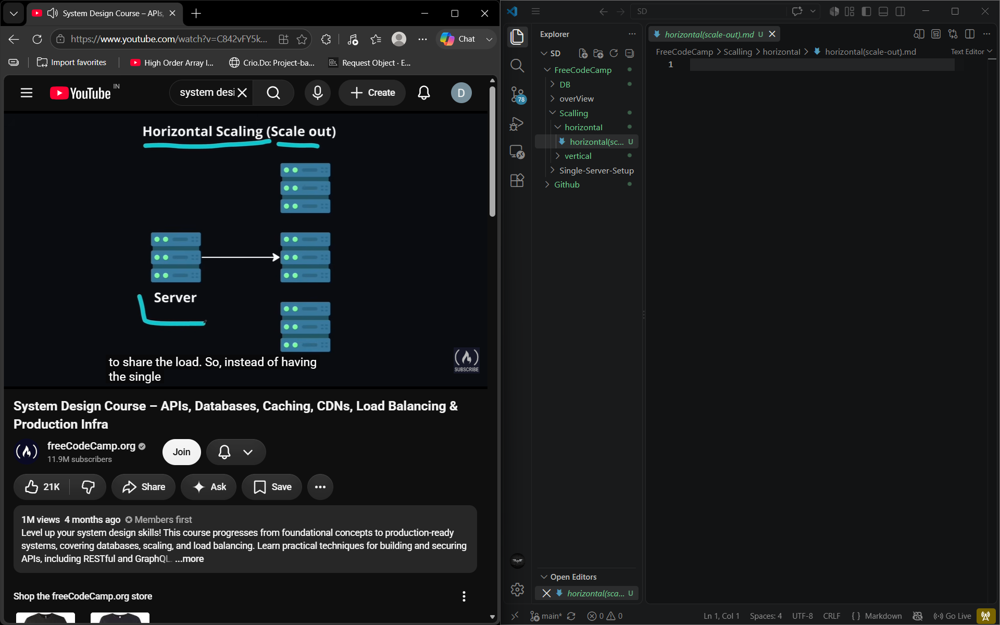
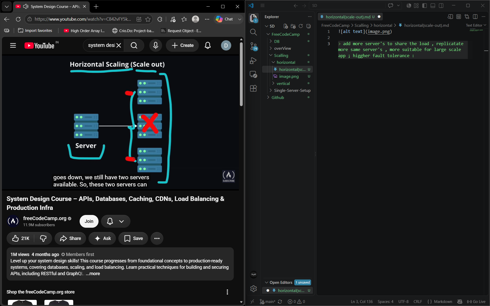

> add more server's to share the load , replicatate more same server's , more suitable for large scale app ; higgher fault tolerance :  we still have 2 server's while the gone 1 recover's

> better scalibilty : you can add more serve's