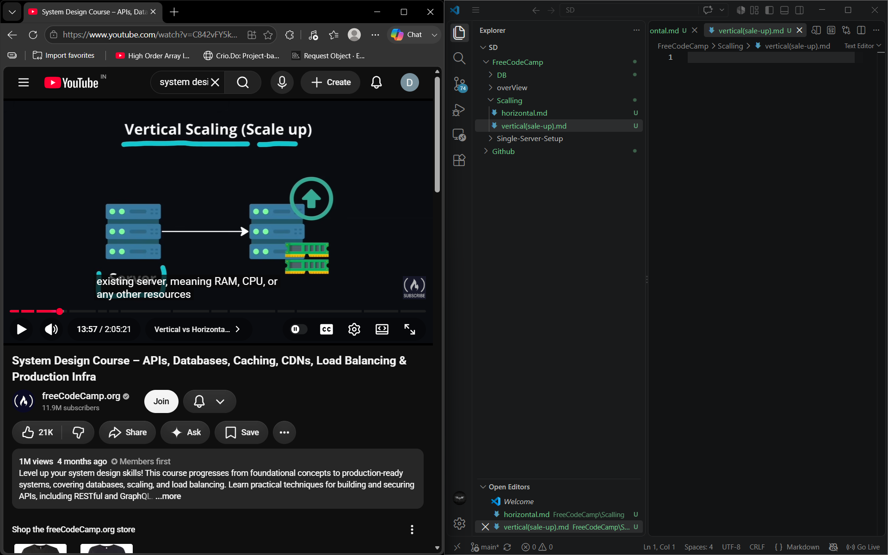
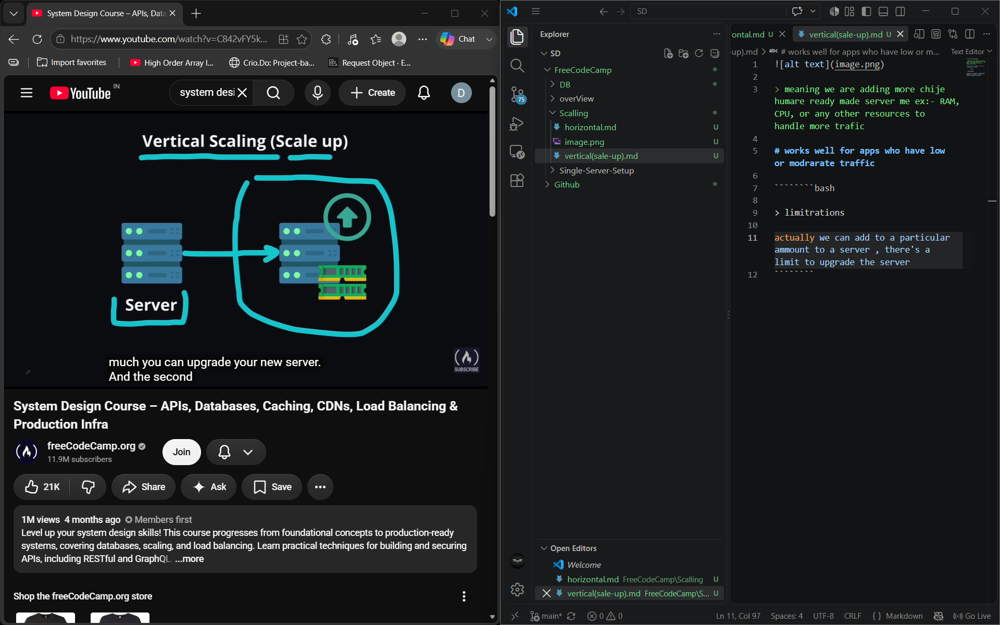
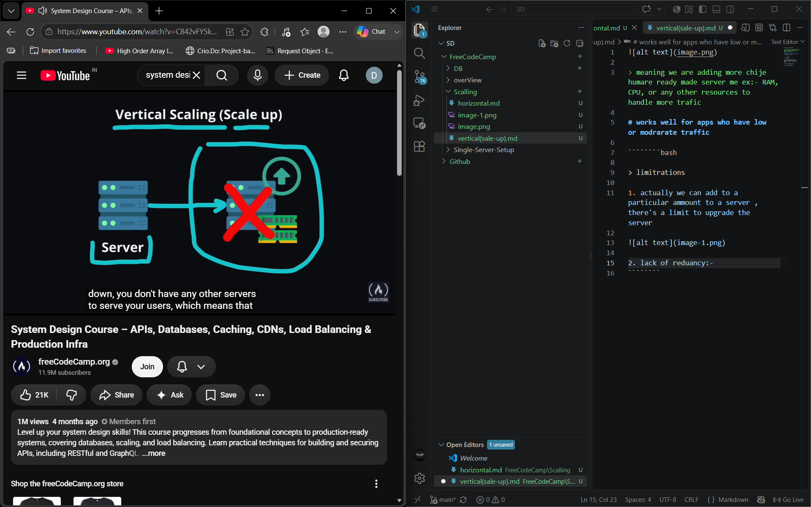

> meaning we are adding more chije humare ready made server me ex:- RAM,CPU, or any other resources to handle more trafic

# works well for apps who have low or modrarate traffic

````````bash

> limitrations

1. actually we can add to a particular ammount to a server , there's a limit to upgrade the server 



2. lack of reduancy:- ek banda puri team sambhal rha hai (ek server gya app gya)




````````