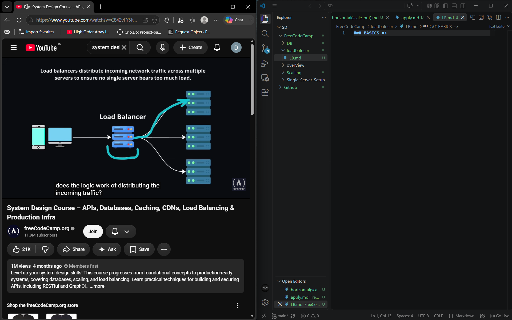
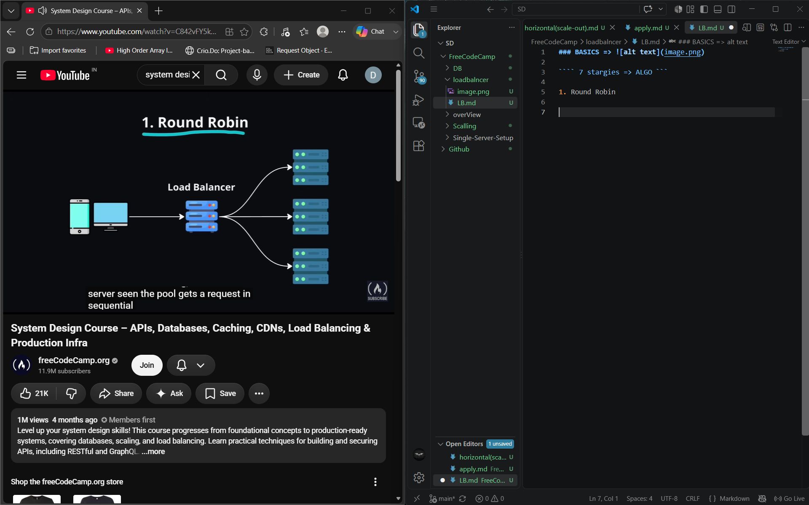
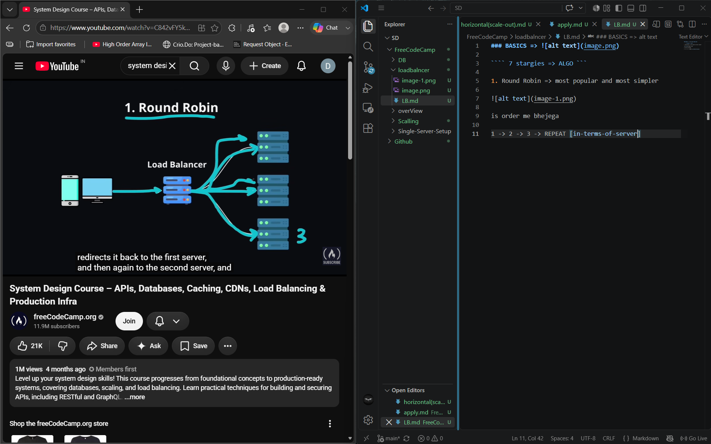
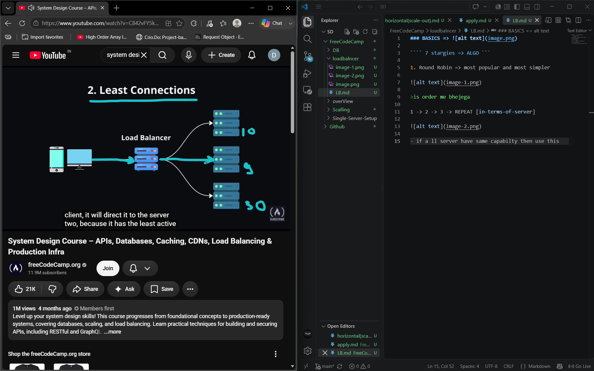
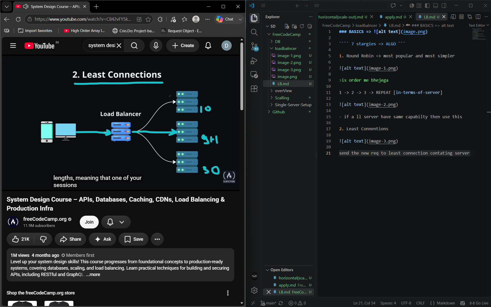
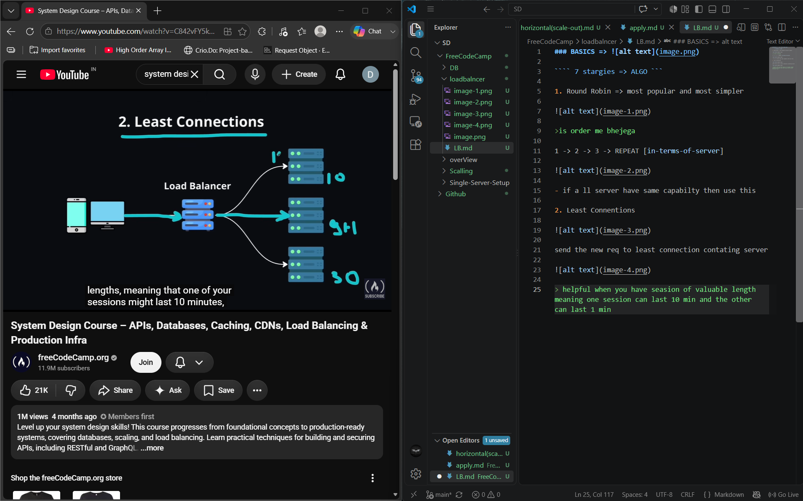
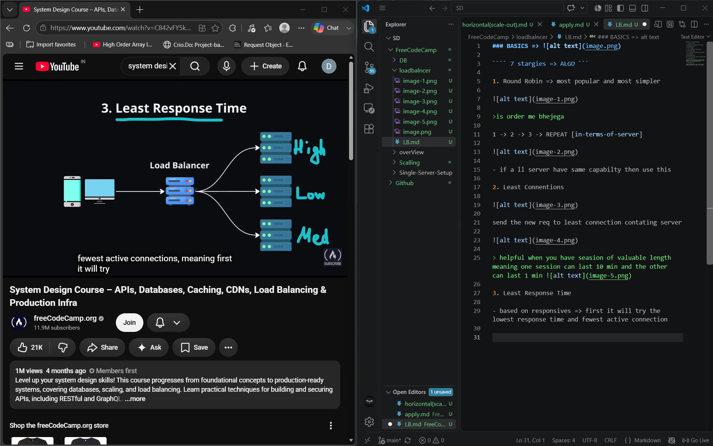
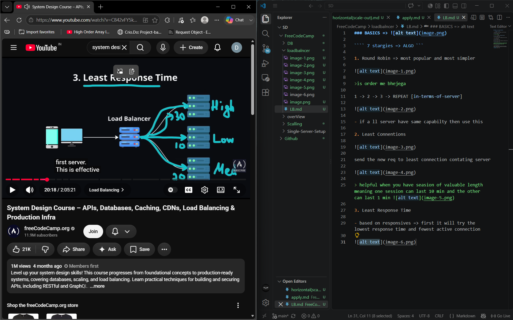
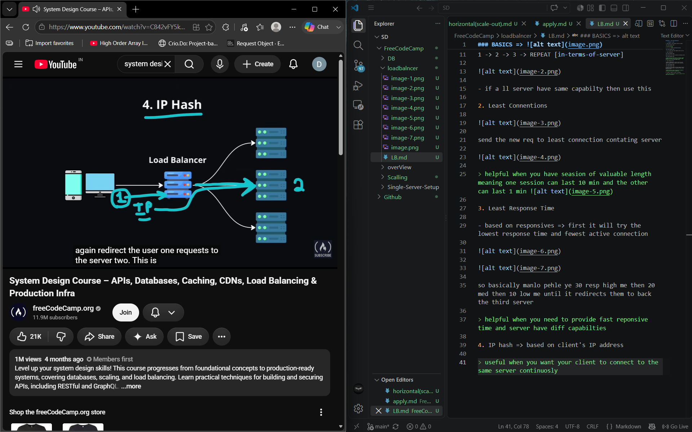

### BASICS => 

```` 7 stargies => ALGO ```

1. Round Robin => most popular and most simpler 



>is order me bhejega 

1 -> 2 -> 3 -> REPEAT [in-terms-of-server]



- if a ll server have same capabilty then use this 

2. Least Connentions



send the new req to least connection contating server



> helpful when you have seasion of valuable length meaning one session can last 10 min and the other can last 1 min 

3. Least Response Time 

- based on responsives => first it will try the lowest response time and fewest active connection 





so basically manlo pehle ye 30 resp high me then 20 med then 10 low me until it redirects them to back the third server 

> helpful when you need to provide fast reponsive time and server have diff capabilties 

4. IP hash => based on client's IP address

> useful when you want your client to connect to the same server continuosly 



now if client1 send a req lb will hash it's ip and lets say it will send it to 2nd server now the client will get the req to 2nd server 

- if 2nd server have some info about your client then this algo is a good choice 